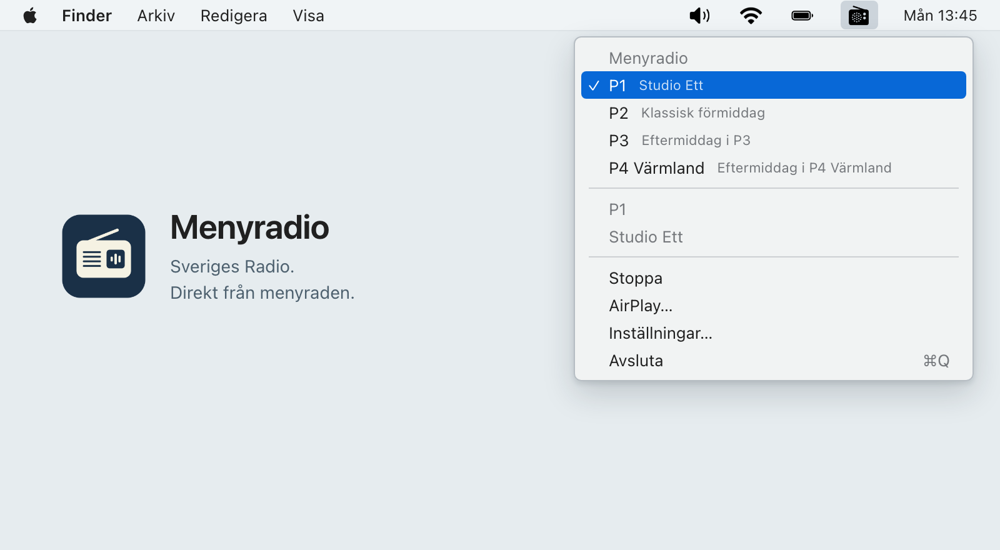

# Menyradio

Sveriges Radio, right in your Mac's menu bar.

Menyradio is a small radio app for listening while you work. Click the radio icon, choose a channel, and keep listening when you close the menu.




## What it does

- Plays P1, P2, P3 and local P4 stations.
- Lets you choose and reorder the channels in your menu.
- Shows the current programme or song when information is available.
- Shows what's playing when you hover over the radio icon.
- Includes an AirPlay speaker picker and macOS media controls.
- Can start automatically when you log in.

The app stays in the menu bar, with no Dock icon or main player window. It plays the original live stream without added sound effects.

## Getting started

Requires **macOS 14 or later**, on Apple Silicon or Intel.

1. [Download the latest release](https://github.com/imwithfriends/menyradio/releases/latest) and unzip it.
2. Move **Menyradio.app** to Applications.
3. Open the app and look for the radio icon in the menu bar.

The repository is currently private, so downloading requires access. This first release is not Developer ID-signed or notarized. If macOS blocks it, try opening it once, then go to **System Settings → Privacy & Security → Open Anyway**. See [Apple's instructions](https://support.apple.com/en-us/102445).

### Build from source

You'll need **Xcode 16 or later**.

```sh
git clone https://github.com/imwithfriends/menyradio.git
cd menyradio
./build.sh --run
```

The app is created at `build/Menyradio.app`. You can open it from there or move it to Applications.

## Listening

Click the radio icon in the menu bar and choose a channel. A checkmark shows the selected channel. Choose **Stoppa** to stop listening.

Open **Inställningar…** to add local P4 stations, reorder your favourites or enable launch at login. For launch at login, keep the app in Applications and approve it in System Settings if macOS asks.

To listen on an AirPlay speaker, choose **AirPlay…**, then click the AirPlay symbol in the small speaker-selection window. The normal radio menu remains a simple list.

## About

Built with native Apple frameworks, with no third-party dependencies. Inspired by the simplicity of [RÚV Noise](https://github.com/jokull/ruv-noise).

This is an independent project, not affiliated with Sveriges Radio. Channel and programme information comes from SR's public API. [The API is no longer maintained](https://www.sverigesradio.se/artikel/dokumentation-for-api-version-2), so metadata may occasionally be unavailable.

For API endpoints, tests and implementation details, see the [development notes](docs/development.md).
